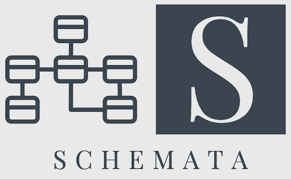
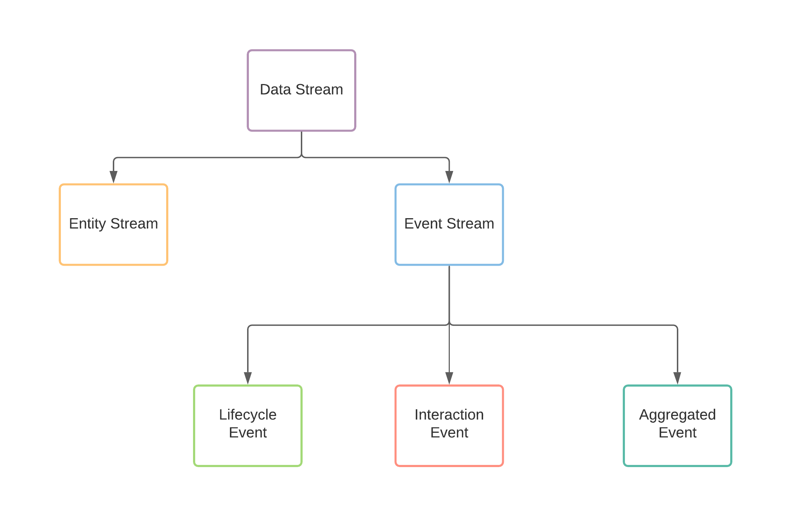
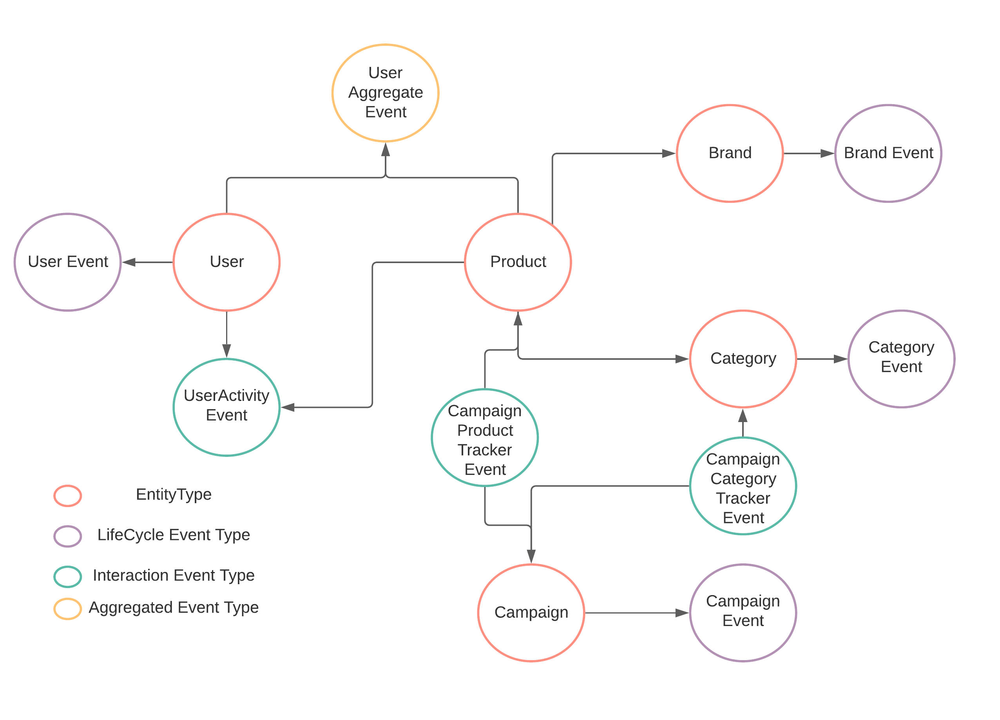

# Schemata

Schemata is a schema modeling framework for decentralized domain-driven ownership of data. Schemata combine a set of
standard metadata definitions for each schema & data field and a scoring algorithm to provide a feedback loop on how
efficient the data modeling of your data warehouse is. Schemata support ProtoBuf & Avro formats.

<p>
    <a href="https://github.com/ananthdurai/schemata/releases/"></a>   
    <a href="https://github.com/pdevito3/craftsman/blob/master/LICENSE.txt"></a>
  <a href="https://twitter.com/ananthdurai" target="\_parent">
    
  </a>
</p>

------

Before we jump on let's walk through Garbage-In Garbage-Out (GIGO) problem in the data lake

# The Garbage-In Garbage-Out (GIGO) Problem

A data Warehouse is a centralized repository that allows you to store all your structured and unstructured data at any scale.
As the definition suggests, Data Warehouse focuses on centralized data storage to break the organization’s data silo. The
central repository removes entry barriers to integrating and analyzing various data sources in an organization.
However, as the data warehouse grows, the complexity of the data management grows.

1. The data producer generates data and sends it to the data lake.
2. The consumers down the line have no domain understanding of the producer and struggle to understand the data lake
   data.
3. The consumers then connect with the data producer to understand the data. The producer side’s domain
   expertise depends on human knowledge that may or may not be available.

Data Warehouse becomes a technical debt rather than a strategic advantage as it grows.

# How do Schemata solve the Garbage-In Garbage-Out (GIGO) problem?

## Schemata Enable Domain-Oriented Data Ownership
Schemata focus on treating data as a product. The feature team that works on the product feature has the domain understanding of the data, not the data's consumer. 
Schemata enable the data ownership to the feature team to create, attach metadata, catalog the data, and store it for easier consumption.

The data curation and the cataloging of the data at the data creation phase bring more visibility and make it easier for consumption. 
The process also eliminates the human knowledge silo and truly democratizes the data. 
It helps the data consumers not worry about the data discovery and focuses on producing value from the data.

## Schemata Facilitates Decentralized Data Modeling

Traditionally upfront data modeling comes with a cost. Often a centralized data architecture/ modeling team coordinates with multiple teams to design an enterprise data modeling. 
It is hard for one individual human to hold the entire company's data architecture in their head. 
The data modeling tools don't reflect the current state of the data modeling. 
Decentralized data modeling is the only scalable approach, and Schemata enables the bottom-up crowdsourcing data modeling approach to democratize data access in an organization.

## Schemata Bring DevOps principle to data modeling 

The decentralized data modeling principle brings a unique collaborative approach to managing the data asset's lifecycle. 
It brings all the proven devops principles like ownership, accountability, collaboration, automation, continuous improvement, and customer-centric action to the data management.

## Schemata Enforce the Connectivity & Integrity of the Data Model
Data is inherently social in nature. The significant challenge of decentralized data management is that the lack of connectivity among the data will degrade its usability of the data. 
Schemata is an opinionated data modeling framework that programmatically measures the connectivity of the data model and assigns a score to it. We call this Schemata Score.

Observability metrics like SLO & Apdex Score inspired the formation of Schemata Score. 
A lower the Schemata Score means lesser the data connectivity of a data model. 
It allows the teams collaboratively fix the data model and bring uniformity to the data.

## WIP: Schemata Ruby on Rails Experience for Data Engineering

🚧 This is still under development. Watch this space for more details soon.

# Design

Schemata frameworks contain two parts.

📘 **Schema metadata annotations:**

The metadata annotations enrich the context of the schema definitions. It enforces a few mandatory metadata fields such
as the owner of the schema, the domain it represents, and further classification of the Schema into Entity stream &
event stream.

🎼 **Schemata Score:**

A ranking function parses all the metadata and assigns a score for each Schema definition to define how integrated the
Schema design is and validate if all the Schema definition adheres to the Schemata metadata annotations.

## Schema Metadata

### Core Metadata (shared across Schema and Fields)

```protobuf
// CoreMetadata is the set of attribute apply to both the Message & Field
message CoreMetadata {
  // Mandatory Metadata: description of the entity
  optional string description = 50001;
  // Optional Metadata: additional comments about the entity
  optional string comment = 50002;
  // Optional Metadata: Any related entity that has "hierarchy" or "has a"  relationships.
  optional string see_also = 50003;
  // Optional Metadata: Additional link reference for further reading.
  // It could be a confluent page, An ADR or RFC or a Slack message link.
  optional string reference = 50004;
}
```

### Schema Metadata

```protobuf
extend google.protobuf.MessageOptions {

  // message.description is a Mandatory Metadata
  CoreMetadata message_core = 60001;
  // Mandatory Metadata: owner of the entity. Usually it is the team name.
  string owner = 60002;
  // Mandatory Metadata: domain = 'core' indicates the entity is common across all the domains.
  // Other possible domains are `sales`, `marketing`, `product` etc
  string domain = 60003;
  // Mandatory Metadata: define the type of the message.
  Type type = 60004;
  // Status of the entity. You can have `testing`, `production` or `staging` depends on the lifecycle of schema definition.
  string status = 60005;
  // Slack or Teams channel name to communicate with the team which owns ths entity
  string team_channel = 60006;
  // Slack or Teams channel name to alert for any validation errors.
  string alert_channel = 60007;
  // Type of the event. Set if the Type = 'EVENT'
  EventType event_type = 60008;
}
```

### Field Metadata

```protobuf
extend google.protobuf.FieldOptions {
  // message.description is a Mandatory Metadata
  CoreMetadata field_core = 70001;
  // Set true if the field contains classified data (Optional).
  bool is_classified = 70002;
  // Set the classification level if is_classified is true (This is Mandatory if is_classified set to true)
  string classification_level = 7003;
  // Specify the product type. product_type is an useful annotation to represent a field in a business perspective.
  // (e.g) user_id can be an INT field, but in the system design it could represent External Users rather than internal users.
  string product_type = 70004;
  // Set true if the field is a primary key. This must be true if the Schema type is Entity
  bool is_primary_key = 70005;
}
```

## Schema Classification



At any point in time, the data producer should provide two types of data products.

### Entity

Entity streams represent the current state of the Entity. In the classical Data Warehouse concepts, Entities typically
represent the dimensions. The Entity must have a primary key field.

**Sample Entity Definition**

```protobuf
message User {

  option(message_core).description = "This is the description of the users table";
  option(message_core).comment = "The comment added after thought";
  option(message_core).see_also = "db.user MySQL table";
  option(owner) = "Platform";
  option(domain) = "Core";
  option(type) = ENTITY;
  option(team_channel) = "#team-platform";
  option(alert_channel) = "#alerts-platform";

  int32 id = 1
  [(field_core).description = "Unique identifier for User", (is_primary_key) = true];

  string name = 2
  [(field_core).description = "Name of the user"] ;

  string email = 3
  [(field_core).description = "email id for the user", (product_type) = "username", (is_classified) = true, (classification_level) = "LEVEL1"] ;

  bool is_active = 4
  [(field_core).description = "define the active status of the user. `true` == active; `false` = inactive`", (field_core).comment = "should refactor to non-binary status"];

  string timezone = 5
  [(field_core).description = "preferred time zone for the user"] ;
}
```

### Event

Event streams are typically immutable. Event streams represent the state change of an Entity. In the classical data
warehouse concepts, Event streams represent the facts. Event streams will not have a primary key field.

Events classified further into three types.

#### Type 1: Lifecycle

Lifecycle event captures the state changes of an Entity. (e.g) User created, User deleted et al.

**Sample Lifecycle Event**

```protobuf

enum ActivityType {
  CREATED = 0;
  DELETED = 1;
  UPDATED = 2;
}
message UserEvent {
  option(message_core).description = "This is the description of the users table";
  option(owner) = "Platform";
  option(domain) = "Core";
  option(type) = EVENT;
  option(event_type) = LIFECYCLE;
  option(team_channel) = "#team-platform";
  option(alert_channel) = "#alerts-platform";

  User previous_user_state = 1
  [(field_core).description = "Previous version of the user entity before the mutation"];

  User current_user_state = 2
  [(field_core).description = "Current version of the user entity before the mutation"];

  ActivityType activity_type = 3
  [(field_core).description = "Lifecycle event type for the Users table"];

  google.protobuf.Timestamp timestamp = 4 [(field_core).description = "Timestamp of the activity"];
}
```

#### Type 2: ACTIVITY

ACTIVITY event captures the events that resulted from one Entity changing the state of another Entity.
(e.g.) User A purchases Product B. The ACTIVITY event is often the result of a business transaction.

**Sample ACTIVITY Event**

```protobuf
enum UserActivityType {
  VIEW = 0;
  READ_REVIEW = 1;
  VIEW_DESCRIPTION = 2;
}
message UserActivityEvent {
  option(message_core).description = "This is the description of the users table";
  option(owner) = "Product";
  option(domain) = "Growth";
  option(type) = EVENT;
  option(event_type) = ACTIVITY;
  option(team_channel) = "#team-growth";
  option(alert_channel) = "#alerts-growth";
  User user = 1 [(field_core).description = "User entity reference"];
  Product product = 2 [(field_core).description = "Product entity reference"];
  UserActivityType activity_type = 3 [(field_core).description = "Type of the user activity"];
  google.protobuf.Timestamp timestamp = 4 [(field_core).description = "Timestamp of the activity"];
}
```

#### Type 3: Aggregated

Aggregated event captures the computed metrics over a specified window of time. (e.g) Number of views by a User for a
Product.

**Sample Aggregated Event**

```protobuf
enum TimeUnit {
  SECONDS = 0;
  MINUTES = 1;
  HOURS = 2;
}
message UserActivityAggregate {

  option(message_core).description = "This is the aggregated user activity view count. The event aggregated by user & product";
  option(owner) = "Product";
  option(domain) = "Growth";
  option(type) = EVENT;
  option(event_type) = AGGREGATED;
  option(team_channel) = "#team-growth";
  option(alert_channel) = "#alerts-growth";

  User user = 1[(field_core).description = "User entity reference"];
  Product product = 2 [(field_core).description = "Product entity reference"];
  int64  count = 3 [(field_core).description = "Aggregated count of the user activity per product", (product_type) = "activity_count"];
  int32 windowTime = 4 [(field_core).description = "Max window time for the aggregation"];
  TimeUnit window_time_unit = 5 [(field_core).description = "TimeUnit of window for the aggregation"];
  google.protobuf.Timestamp timestamp = 6 [(field_core).description = "Timestamp of the activity"];

}
```

# Schema Score:

## The goal of Schemata Score:

Schemata Score is the core part of establishing a feedback loop to maintain the integrity of the decentralized domain
ownership to build data products. In a decentralized data management world, The feature teams (domain owners) define the
Schema to track the Events & Entities. Often it goes to a central schema group to validate the Schema since the feature
team visibility is limited to its domain. It brings the human into the loop and kills the purpose of distributed data
ownership. The workflow is also harder for a centralized team since it is hard for one human to keep the entire
organization's Schema in their head.

The intuition behind the Score is to see if we can programmatically find out which event or entity is less connected in
the Schema to improve the connectivity of Schema. Schemata Score provides schema abstraction and the feedback loop to
help model the Schema with less communication overhead.

Schemata construct a Directed Weighted MultiGraph to represent the Schema definitions (Entity & Events). The Graph walk
algorithm derives the Schemata Score indicating how connected each entity is.

## How it works?

Let's take a sample schema and walk through how Schemata score is computed.



## How the Schemata score computed?

Every type of schema have its own unique properties. So we can't apply the same scoring technique to each type if
schema.

### Entity Score:

```math
Score = 1 - ((Total Incoming Edges + Total Outgoing Edges)) / Total Edges in the Graph 
```

If you run the Schemata Score for User you'll get 0.222

```shell
./score.sh org.protocol.schema.User
Schemata score for org.protocol.schema.User : 0.222
```

If you run the Schemata Score for Product you'll get 0.389

```shell
./score.sh org.protocol.schema.Product
Schemata score for org.protocol.schema.Product : 0.389
```

The Schemata score indicates that Product Entity much more connected than User Entity

#### Lifecycle Events Score

```math
Score = Total Outgoing Edges > 1 ? 1 : 0
```

User event captures the lifecycle of User Entity. So if you run Schemata Score for UserEvent, it will give you 1.0

```shell
./score.sh org.protocol.schema.UserEvent
Schemata score for org.protocol.schema.UserEvent : 1.0
```

### Activity & Aggregated Events Score

```math
Score = 1 - ((Total Outgoing Entity Vertex + Total Outgoing Vertex of all Entity Vertex Connected by ACTIVITY or Aggregated Event) / Total Entity Vertex in the Graph) 
```

If you run schemata score for CampaignCategoryTrackerEvent you will get **0.4**

```shell
./score.sh org.protocol.schema.CampaignCategoryTrackerEvent
Schemata score for org.protocol.schema.CampaignCategoryTrackerEvent : 0.4
```

if you run schema score for CampaignProductTrackerEvent you'll get **0.8**

```shell
./score.sh org.protocol.schema.CampaignProductTrackerEvent
Schemata score for org.protocol.schema.CampaignProductTrackerEvent : 0.8
```

The CampaignProductTrackerEvent connect to Product, which has high connectivity with other dimensions such as Brand &
Category where CampaignCategoryTrackerEvent is the leaf dimension. The score indicates a clear schema modeling issue.

## Schema Score Classification

***Excellent:*** 0.75 to 1.00 is excellent.

***Good:*** 0.50 to 0.75 is good.

***Requires Attention:*** 0.25 to 0.50 require attention

***Blocker:*** less than 0.25 is a code blocker

# Curious to Try?

The code ships with an example ProtoBuf schema definition for easier understanding.

## Prerequisites

The project requires the following dependencies

1. JDK 17
2. ProtoBuf
3. Makefile
4. Maven

## How to execute

🏃 compile the project

```shell
make package or mvn clean package
```

### Directly via the packaged jar

```
alias schemata="java -jar target/schemata-1.0.jar"
schemata --help
schemata score --source=src/test/resources/descriptors/entities.desc --provider=PROTOBUF org.schemata.schema.CampaignCategoryTrackerEvent
schemata validate --source=src/test/resources/descriptors/entities.desc --provider=PROTOBUF # this has some validation errors you can inspect
schemata document --source=src/test/resources/descriptors/entities.desc --provider=PROTOBUF # see JSON representation of schema
```

### Via convenience scripts

🏃 To validate the schema definition

```shell
./validate.sh
```

🏃 To see of Schemata Score

```shell
./score.sh org.protocol.schema.CampaignCategoryTracker
```

🏃 To see the JSON documentation

```shell
./document.sh
```

## Using protobuf descriptors for your own data model

Compile the protobuf descriptors using `protoc` to output
binary [google.protobuf.FileDescriptorSet](https://github.com/protocolbuffers/protobuf/blob/b48ba578dd01adfebeb4fac0887db1eeb163e00f/src/google/protobuf/descriptor.proto#L57-L59)
files.

```shell
protoc --include-imports --descriptor_set_out=mymodel.desc -I path/to/schema -I path/to/protocol/schemas path/to/schema/**/*.proto

./score.sh validate -s=mymodel.desc -p=PROTOBUF
```

## Done:

🚧 Support for Avro.
🚧 Support for ProtoBuf.

## InProgress:
🚧 Support for dbt model.

## TODO:

🚧 Support for JSON schema.

🚧 Support for Thrift.

🚧 Add visualization layer to show the graph representation of the Schema.

# Contributing

Time is of the essence. Before developing a Pull Request I recommend opening a
new [topic for discussion](https://github.com/ananthdurai/schemata/discussions). It is an initial release, so I've not
added the `contributing.md`, but if you are interested, I will definitely put together a detailed writeup.

# Contact Me

Sometimes Github notifications get lost in the shuffle. If you file an issue and don't hear from me in 24-48 hours feel
free to ping me on [twitter](https://twitter.com/ananthdurai) now for easy contact with me and larger community
discussions!
